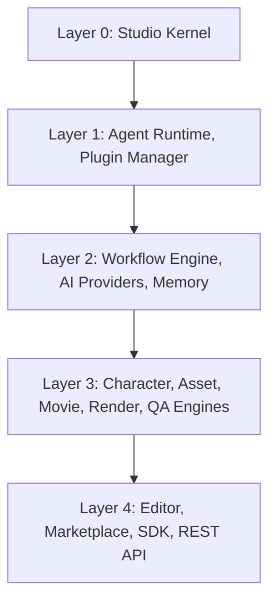

# System Architecture

## Purpose
Provides a high-level overview of NUTANAA Studio OS's system architecture. This is an index and summary document — detailed architecture lives entirely in `docs/architecture/` and is not repeated here.

## Scope
System layers, module relationships, execution flow, major components, data flow, and technology boundaries, at a level suitable for onboarding and cross-team communication. For implementation-level detail, always defer to `docs/architecture/`.

## Audience
Engineering leadership, new contributors, AI coding agents needing a map before reading detailed architecture documents.

## System Layers

Full module definitions, responsibilities, and exact dependency lists: `docs/architecture/01-System-Modules.md`.

## Module Relationships
All inter-module communication occurs through defined contracts/interfaces, never direct calls, per the Module Communication Rule in `docs/architecture/01-System-Modules.md`. A module in a given layer may only depend on modules in the same or a lower layer.

## Execution Flow
A representative request flows: Editor → Workflow Engine → Agent Runtime → AI Providers (via UPI) → domain engines → Memory. Full sequence detail: `docs/architecture/02-Data-Flow.md`.

## Major Components
| Component | Role |
|---|---|
| Studio Kernel | Foundational runtime services |
| Agent Runtime | Executes and manages agent lifecycle |
| Workflow Engine | Orchestrates multi-step, multi-agent processes |
| Plugin Manager | Loads, isolates, and manages plugins |
| AI Providers (UPI) | Provider-agnostic AI capability access |
| Memory | Persistent, versioned state storage |
| Domain Engines | Movie, Character, Asset, Render, QA |
| Editor / Marketplace / SDK / REST API | User-facing and integration surfaces |

## Data Flow
Data crossing a module boundary always goes through a contract interface; state that must persist always lands in Memory before being considered durable. Full detail: `docs/architecture/02-Data-Flow.md`.

## Technology Boundaries
The architecture is technology-agnostic at the contract level — any language or runtime can implement a module or plugin as long as it satisfies the relevant interface. The reference implementation uses Python; see `06-Technology-Stack.md` for the chosen stack.

## Relationship with Other Documents
This document summarizes `docs/architecture/01` through `10`; it does not supersede or duplicate them.

## References to Architecture
All ten documents under `docs/architecture/`.

## References to Specifications
`docs/specifications/00-Specification-Overview.md`.

## Future Evolution
Updated whenever a new architecture document is added or an existing module's layer/dependencies change materially.

## Document Ownership
Chief Architect.

## Version Information
Version 1.0.

## Change Management
Structural changes require an ADR per `16-Decisions.md` and architecture review before merge.
