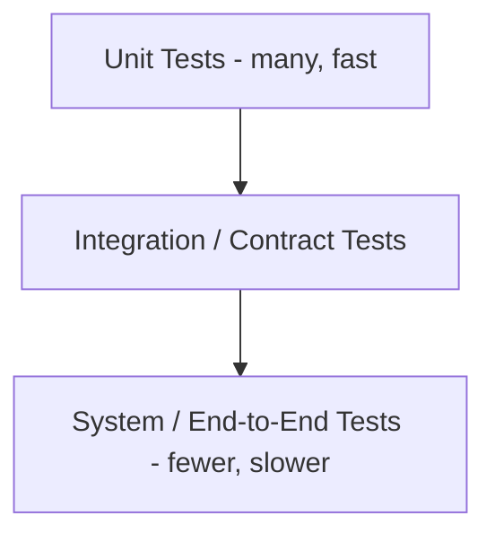

# Testing Strategy

## Purpose
Defines the enterprise testing strategy for NUTANAA Studio OS, ensuring every functional and non-functional requirement is verifiable.

## Scope
Testing philosophy, test types, coverage expectations, tooling, and release gating. Language-level testing conventions are in `07-Coding-Standards.md`.

## Audience
Engineering, QA, release management.

## Testing Philosophy
Every feature must have tests per Engineering Principle #6; tests are written alongside code, not deferred. Testing validates both individual module correctness and adherence to the contracts defined in `docs/architecture/`.

## Testing Pyramid

## Unit Testing
Tests a single function/class in isolation with dependencies mocked, per `07-Coding-Standards.md`.

## Integration Testing
Verifies data flow across module boundaries matches `docs/architecture/02-Data-Flow.md`.

## System Testing
Verifies the assembled system behaves correctly across a full user scenario spanning multiple modules.

## End-to-End Testing
Validates a complete creative production workflow from request to final export, per `03-Functional-Requirements.md`.

## Acceptance Testing
Each functional requirement's Acceptance Criteria (`03-Functional-Requirements.md`) is validated before a feature is considered complete.

## Regression Testing
A standing suite re-run on every change to catch unintended breakage in previously working functionality.

## Smoke Testing
A minimal fast-running suite verifying core system health after deployment, run before full regression suites.

## Performance Testing
Validates response times against `04-NonFunctional-Requirements.md`'s performance targets.

## Stress / Load / Scalability Testing
Validates system behavior under high concurrent workflow/agent load, and horizontal scaling of stateless engines per `04-NonFunctional-Requirements.md`.

## Security Testing
Validates authentication, authorization, and plugin sandboxing boundaries per `13-Security.md` and `docs/architecture/09-Security.md`.

## Plugin Compatibility Testing
Validates a plugin against its declared manifest and UPI/Studio OS version range before Marketplace listing, per `docs/architecture/07-Plugin-System.md`.

## Provider Compatibility Testing
Contract tests verify a provider implementation genuinely conforms to the Universal Provider Interface, per `docs/architecture/04-Provider-Interfaces.md`.

## AI Output Validation
Automated checks assess generated content against basic quality thresholds (e.g. non-empty output, expected duration/resolution) before passing to Review Pipeline.

## Character Consistency Testing
Validates that a character's visual identity remains consistent across generated scenes referencing the same Character DNA, per Engineering Principle #15.

## Scene Consistency Testing
Validates continuity (lighting, framing, character state) across scenes within a sequence.

## Video Quality Testing
Automated checks for resolution, artifact detection, and format correctness of rendered output.

## Rendering Validation
Verifies Render Engine output matches requested camera, lighting, and format configuration, per Functional Requirements `FR-CAM-01`, `FR-LGT-01`, `FR-RND-01`.

## Workflow Validation
Verifies workflow graphs are structurally valid (no cycles) before execution, per `FR-WFB-02`.

## UI Testing
Automated and manual testing of Editor interactions, including accessibility checks per `04-NonFunctional-Requirements.md`.

## API Testing
Automated tests against REST API endpoints for correctness, authentication, and error handling.

## SDK Testing
Validates SDK-generated plugin/provider scaffolds pass manifest validation, per `FR-SDK-01`.

## CLI Testing
Automated tests for CLI command behavior and output correctness.

## Automated vs. Manual Testing
Automated testing covers regression, contract, and acceptance criteria wherever feasible; manual testing covers exploratory UX evaluation and edge cases not yet automated.

## Continuous Testing
Automated suites run on every pull request via CI, per `06-Technology-Stack.md`.

## Coverage Targets
A specific minimum coverage percentage is deferred until enough real modules exist to set a realistic baseline (open item carried over from `07-Coding-Standards.md`).

## Testing Tools
pytest for Python; corresponding TypeScript testing framework for Editor/frontend, per `06-Technology-Stack.md`.

## Test Data Management
Synthetic and anonymized test data is used for automated tests; no real user or customer content is used in test fixtures.

## CI Integration
Linting, formatting, and test suites run automatically on every pull request; a failing check blocks merge, per `08-Repository-Standards.md`.

## Release Gates
A release candidate must pass the full regression and acceptance suite in Staging before promotion to Production, per `14-Deployment.md`'s release process.

## Relationship with Other Documents
Validates the requirements in `03-Functional-Requirements.md` and `04-NonFunctional-Requirements.md`; gates the release process in `20-Release-Strategy.md`.

## References to Architecture
`docs/architecture/02-Data-Flow.md`, `04-Provider-Interfaces.md`, `07-Plugin-System.md`.

## References to Specifications
All `docs/specifications/` documents, for subsystem-specific validation criteria.

## Future Evolution
Coverage targets and specific performance thresholds will be finalized once baseline implementation exists.

## Document Ownership
QA Architect.

## Version Information
Version 1.0.

## Change Management
Changes to release gate criteria require sign-off from Release Manager and QA Architect.
